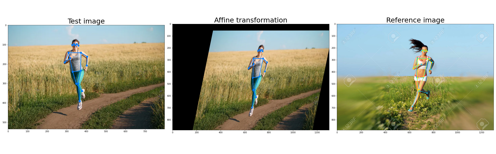

# DancingSkeletons

This program scores the synchronicity of movements between persons in a video file. 

Basic usage: 
<code>python3 skeletons3 in_videofile out_videofile</code>

See also the examples of the [input](https://disk.yandex.ru/i/cSsSEIRz1S5Tww) and [output](https://disk.yandex.ru/i/hL-r_zvcufEH6A) video files. This repository is made as the Skillfactory Compute Vision course work, the presentation is [here](https://disk.yandex.ru/i/s0erA9L6h6PUFA) (MS PowerPoint .pptx) and contains some information on the algorithms used.

Behind is the neural network [Keypoint R-CNN with the ResNet-50-FPN backbone](https://pytorch.org/vision/main/models/generated/torchvision.models.detection.keypointrcnn_resnet50_fpn.html) and a specially designed scoring procedure for estimating the similarity score based on affine transformations and calculation of distances between 9 pose keypoints. The score is averaged for all the persons detected in the frame.

## Installation

<code>
git clone https://github.com/DKudryavtsev/DancingSkeletons

cd DancingSkeletons

pip install -r requirements.txt 
</code>

You also need FFmpeg to be installed system-wide. It can be taken from your operating system distribution (preferrable for Linux-based systems) or directly from [FFmpeg site](https://www.ffmpeg.org/). For Debian/Ubuntu:

<code>
sudo apt install ffmpeg
</code>

## Hardware

An NVIDIA GPU is needed to process a video file in a reasonable amount of time. The bottleneck of the processing is keypoint detection by the neural network, therefore the GPU performance is critical. As an example, the working time for a 720p video with GeForce RTX 3080 is about the length of the video, while about 5 times as longer with GTX 1650.

## Usage

    python3 skeletons.py in_videofile out_videofile [-h] [-b BATCH_SIZE] [--score | --no-score]
 
    positional arguments:
      in_videofile          Input video file
      out_videofile         Output video file
    
    options:
      -h, --help            show this help message and exit
      -b BATCH_SIZE, --batch_size BATCH_SIZE
                            Batch size (default: 4)
      --score, --no-score   Get synchronicity score

## Other notices

* The neural network inference can be made in batches (4 frames per an inference by default), but the total processing time is not much affected by the batch size. Notice that a greater amount of GPU memory is needed for larger batches.

* The "examples" directory contains a couple of Jupiter notebooks with examples of skeleton drawing, similarity metrics, and affine transformation:

